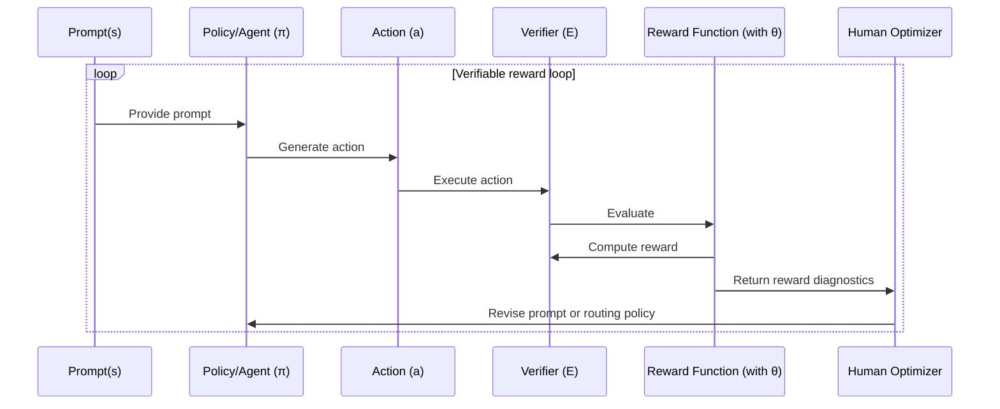

Defining what we require from generative models has become a geometry problem. A prompt describes intent, but the model optimizes whatever signal it can see. That gap is where **specification gaming** shows up: the output can satisfy the letter of a requirement while missing the behavior we actually wanted. The growing adoption of **RLVR** (Reinforcement Learning with Verifiable Rewards)[^1] makes this more concrete by moving part of the objective into checkable, reproducible rewards. But the hard part remains. The evaluation system becomes the environment, and its design determines what “good” actually means.

Mermaid diagrams are a useful stress test for this. They sit at the intersection of structural and semantic correctness. A diagram can render syntactically valid while being semantically incoherent, or it can represent the right concept but be poorly composed. The constraint space is narrow: the output must be both machine-parseable and human-interpretable, and the mapping from natural language query to diagram type is genuinely ambiguous. This makes Mermaid generation a good testbed for reward design because specification gaming has obvious failure modes.

This post documents that design process. I’ll cover three simple agent architectures, the rubric construction, how reward signals were composed to prevent gaming, and finally where the approach reaches its limits in closing the learning loop.

## Experimental setup

Three agents. Same prompt distribution. Different levels of structural guidance and verbosity. The goal was simple in theory: find which prompt architecture best navigates the constrained output space where a diagram is both renderable and semantically correct. In practice, the agents diverged in interesting and sometimes frustrating ways.



This is not a claim that prompts were trained with policy gradients. The loop is a methodology for reward modeling and manual policy iteration: generate outputs, score them with the same verifier, inspect drift, then revise the agent policy with cleaner evidence than open-ended taste.

### Streamlining queries — $s$

The prompt synthesizer generated roughly 1,200 queries spanning four domains: technology, astrophysics, economics, and movie plot summaries. The domains were picked deliberately to stress-test diagram generalization across timeline diagrams for plot arcs, concept maps for economic systems, and entity relationships for scientific hierarchies. The distribution was not uniform. It was biased toward cases where diagram *type* selection would be ambiguous because that is where the agents were most likely to diverge.

### Agents and agentic workflows — $\pi$

The three agents were not just prompt variants. They represented different hypotheses about what makes a good diagram generation policy. The third agent also changed structure after the first pass, once its actions could be observed and compared against the others.

**Agent 1** ran a baseline prompt: simple linear guidance, no explicit chart type list, weak structural constraints. The hypothesis was that the model already knows what a good diagram looks like and just needs a light nudge.

**Agent 2** switched to an XML-formatted prompt, introduced forced chart type selection from an explicit list, and added more verbose guidance on Mermaid diagram quality. The hypothesis was simple: give the model more structure, get more structured outputs.

**Agent 3** added an intermediate rewrite step: a two-step pipeline where the query is first rewritten as a candidate diagram specification, then rendered. It used an explicit Mermaid type list, a stronger task profile, and XML formatting throughout. It was the most engineered of the three.

<figure>
  
  <figcaption>Initial evaluations plotted by reward and win rate per prompt. Point size represents win rate.</figcaption>
</figure>

The result that surprised me most: Agent 1 won. The simplest agent. Agent 3, the most carefully constructed, followed after. More about it later.

### Defining an environment and verifier — $E$

With repeated testing, the verifier settled into two layers. First, render validity is a zero-or-one hard gate: invalid Mermaid gets zero reward. If it renders, the scalar reward combines 65% Judge-LM semantics, 10% contextual alignment, and 25% bounded verbosity. That split matters because format is not a soft preference. It is the permission to score anything else.

#### Judge-LM

The Judge-LM rubric came from repeated review of favorable behaviors, unfavorable behaviors, and failure points in the problem space.

```python
# All numeric fields are scaled from 0–5, delivering a Likert-based rubric.
class JudgeLMCriteria:
    diagram_type_relevance: int  # relevance to the right diagram style
    entity_alignment: int        # factual coverage
    relation_correctness: int    # edge correctness
    abstraction_quality: int     # the right compression level for details
    structural_logic: int        # quality of structural decomposition
    chain_reasonability: int     # whether someone can trace the logic

    rationale: str               # concise explanation (~30 words)
    contextual_relevance: float  # generated-graph alignment with query
```

The six Likert dimensions are not independent, and that is by design. Entity alignment and relation correctness move together. Structural logic and chain reasonability cluster. This internal correlation is useful: it means the judge is self-consistent, and it shrinks the surface area for reward hacking. Fewer orthogonal axes means fewer places for the model to score well on one metric while quietly degrading another.

<figure class="compact-figure" id="judge-score-vs-reward">
  
  <figcaption>Judge score and composite reward correlations.</figcaption>
</figure>

The correlation heatmap is useful because it shows the judge is not acting like a bag of unrelated checks. The stronger blocks cluster where you would expect them to. Entity alignment moves with relation correctness, and structural logic tends to move with chain reasonability. Reward tracks positively with most of the semantic dimensions, but not equally, which is exactly the point of the composite design.

#### Rule-based scoring

```python
def verbosity(mermaid_text):
    # Count structural elements.
    node_count, edge_count = counts(mermaid_text)

    # Weighted raw complexity score.
    raw = float(node_count + 0.5 * edge_count)

    # Range-bounded score that approaches 5.0 as raw grows.
    score = 5.0 * raw / (raw + 10.0)
    return score
```

The verbosity score is soft-bounded. It never hits 5.0; it asymptotes toward it. This matters because it removes the incentive to dump nodes into a diagram. The marginal reward for adding more structure keeps shrinking, so graph inflation does not become an easy reward hack.

### Designing scalar rewards — $r$

Scalar reward design is the make-or-break point. A stronger version of this project would fit a reward model from labeled outcomes, but the useful first slice was explicit: compose the features by hand, then stress-test the weighting. Because several Judge-LM dimensions are correlated, I kept them inside one semantic score instead of pretending every axis was independent.

```python
J = mean(judge_metrics)                       # semantic correctness (0 to 1)
V = asymmetric_gaussian(verbosity, 3.5)      # left_arm=0.4, right_arm=0.6
R = 0 if not render_valid else 0.65*J + 0.10*context + 0.25*V
return round(R, 4)
```

I used Dirichlet sampling to watch where mean reward stayed high *and* stable. The triangular heatmap below is the actual search. Each point is one sampled weight split across judge, context, and verbosity, and the color shows the resulting mean reward. The red dot is the current production weight mix. High judge weight consistently outperformed.

<figure>
  
  <figcaption>Reward sensitivity to judge, context, and verbosity weights.</figcaption>
</figure>

The asymmetric Gaussian on verbosity is worth calling out specifically. 3.5 was empirically the sweet spot that separated genuinely well-structured diagrams from mediocre ones. Below 3.5, the narrower left arm penalizes missing structure more aggressively. Above 3.5, the wider right arm tapers more gently. The asymmetry means the model is penalized harder for under-specifying than for over-specifying.

<figure>
  
  <figcaption>The asymmetric Gaussian used to score diagram verbosity.</figcaption>
</figure>

### Observations on responses — $a$

This is the point where aggregate reward stops being enough and the shape of responses starts to matter. The response distribution tells whether an agent is reliably good, occasionally great, or just volatile under the same evaluator.

<figure>
  
  <figcaption>First-pass reward distribution across agents.</figcaption>
</figure>

This plot is where the story becomes less about averages and more about behavior. Agent 1 does not just win on mean reward. Its median sits higher and its interquartile range is tighter, which is exactly what you want from a baseline in production-like evaluation loops: less drama, fewer surprises. Agents 2 and 3 both show broader spread with lower central tendency, which reads less like “more expressive policy” and more like unstable reward capture under extra structure.

The near-zero outliers across all three are also useful to keep in view. These are likely hard render failures—invalid Mermaid or parser-breaking outputs—which makes them a shared failure mode of the task and verifier pipeline rather than something unique to a single agent. The difference is frequency and recovery: Agent 1 still clusters in the high-reward region more consistently, while the more engineered variants pay a variance tax for the added scaffolding.

## Manual policy iteration — $\pi_\theta(a \mid s)$

This is where I need to be precise. This is not strict RL training. There is no policy-gradient optimizer changing a model from reward traces. The reward signal is real and informative, but the optimizer is me, editing prompts and routing logic after inspecting the diagnostics. The gotcha is not technical. It is architectural.

So I treat this section as policy iteration in spirit, not in the strict training sense: observe failures, revise the agent policies, and re-run the same evaluation environment.

After observing the first pass, I made one coordinated update across all three agents. Agent 3 changed the most by becoming a routing policy that runs Agent 1 and Agent 2 as candidate generators, then uses a discriminator step to pick the better output of the two.

<div class="agent-strip">
  
  
  
</div>

The next four plots diagnose whether the revised policies improved stability, win behavior, and judge-metric drift.

<figure>
  
  <figcaption>Reward and win rate after the coordinated agent update.</figcaption>
</figure>

<figure>
  
  <figcaption>Reward distribution after the second pass.</figcaption>
</figure>

The second-pass scatter and distributions make the tradeoff clearer. Agent 3 becomes more structured, but the routing and discriminator design does not automatically convert into better rewards. It improves control over the generation process, but it also introduces more places where selection or formatting can fail. My rough read from the second pass is that catastrophic failures come down, but the central reward still does not overtake Agent 1.

<figure>
  
  <figcaption>Prompt-level win rate after the redesign.</figcaption>
</figure>

<figure>
  
  <figcaption>Movement in individual judge dimensions after the redesign.</figcaption>
</figure>

The prompt-level win-rate plot is the most direct signal here because it shows where one agent actually beats the others on the same set of prompts. This is the chart I would use in a hiring review because it translates to a practical question: did the redesign improve task success rate, and by how much? In my case the gains are uneven rather than universal. Some prompt families move by visible double-digit percentages, while others stay flat or regress. The drift heatmap is the complement. Instead of showing wins, it shows which judge dimensions moved and in what direction after the redesign.

The rolling reward trends below give the temporal view. Early variance is high, then the curves settle, and Agent 1 stays above the others. Visually, the variance envelope does tighten after the early windows—roughly a 20–30% stability improvement in the better runs—but that stability gain is not the same thing as policy superiority. That looks like learning, but it is just the early variance over the synthetic prompt distribution.

<div class="article-embed">
  <iframe src="/assets/writing/rl-verifier-design/rolling_reward_v1_vs_v2.html" title="Rolling reward trend by agent across the first and second passes" loading="lazy"></iframe>
  <p class="article-caption">Rolling reward trend by agent across both evaluation passes.</p>
</div>

The reward distributions remain the most compact summary of behavior. They show spread, outliers, and median shift in one view. They also make the variance tax visible: the more engineered variants still carry a wider spread, and Agent 3 does not dominate despite being the most structured design.

## Conclusion — the hard parts redefined

The simplest agent won. The most verbose setup reward-hacked itself into mediocrity. The lesson is not that simplicity always wins. It is that a verifier has to be designed against the specific failure modes of the task, not against a generic rubric. The only way to find those failure modes is to watch the model fail repeatedly with instruments on. This is precisely the design space modern evaluation platforms are exploring[^2]: treating structured verification as infrastructure rather than an afterthought.

This is not a replacement for RLHF. It is closer to a 2FA layer for pre-deployment: a way to make behavioral goals explicit and measurable before you let a model near real users.

The real unlock here is commoditizing the attention you would otherwise spend on open-ended human evaluation. With a well-designed verifier, the human in the loop stops being the bottleneck for *judging* outputs and becomes the designer of the policy. That is a better use of the loop.

I’ve linked a [Markdown export of the implementation details](https://drive.google.com/file/d/1atWnA1YfaM310AiAWLfppBF3rqN8e7-6/view?usp=sharing), though the [Marimo notebook](https://github.com/dunkeln/curated_notebooks/blob/mucho/paths/deterministic_verifiable_rewards.py) is the better source of truth.

[^1]: DeepSeek-AI et al. “[DeepSeek-R1: Incentivizing Reasoning Capability in LLMs via Reinforcement Learning](https://arxiv.org/abs/2501.12948).” *arXiv*, 2025.

[^2]: Patronus AI. “[RL Environments: Tutorial & Examples](https://www.patronus.ai/guide-to-rl-environments).” *Patronus AI*, 2026.
